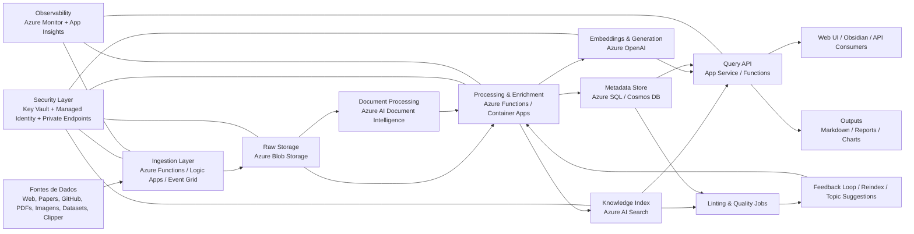
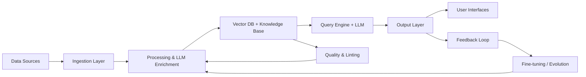

# 🧠 LLM-Powered Knowledge Platform on Azure

Arquitetura corporativa para uma plataforma de conhecimento baseada em LLM, com ingestão, enriquecimento, indexação semântica e consulta inteligente.

---

## 📖 Contexto

Empresas acumulam grandes volumes de informação distribuídos em múltiplas fontes: documentos, tickets, repositórios, logs, dashboards, e-mails, wikis e ferramentas de observabilidade.
Esse conhecimento costuma estar:

- fragmentado
- pouco estruturado
- difícil de buscar
- dependente de pessoas específicas

Com isso, decisões levam mais tempo, incidentes demoram a ser resolvidos e oportunidades passam despercebidas.

A arquitetura proposta cria uma plataforma unificada de conhecimento baseada em IA, onde os dados são ingeridos, organizados, enriquecidos e disponibilizados de forma inteligente para consulta.

## 🧠 Como a arquitetura ajuda na prática

## 1. Centralização do conhecimento
- Consolida informações de múltiplas fontes em um único ambiente
- Elimina silos (GitHub, documentos, dashboards, tickets)
- Cria uma “fonte confiável” para consulta

Impacto: menos dependência de pessoas-chave e menos retrabalho

## 2. Busca semântica (não só palavras-chave)
- Usuário pergunta em linguagem natural
- O sistema entende contexto e intenção
- Recupera conteúdo relevante mesmo sem match literal

Exemplo:
“Por que tivemos queda de performance no mês passado?”
→ sistema cruza incidentes, deploys, métricas e documentação

Impacto: respostas mais rápidas e mais completas

## 3. Assistente inteligente (Q&A com LLM)
- Gera respostas contextualizadas
- Resume conteúdos complexos
- Explica cenários técnicos ou de negócio

Impacto: acelera análise e tomada de decisão

## 4. Conexão entre informações dispersas
- Relaciona documentos, eventos e dados históricos
- Identifica padrões (ex: sazonalidade, falhas recorrentes)

Impacto: visão sistêmica que normalmente não existe manualmente

## 5. Qualidade e governança do conhecimento
- Detecta inconsistências
- Identifica lacunas
- Sugere melhorias e novos conteúdos

Impacto: conhecimento evolui continuamente, não fica obsoleto

## 6. Apoio direto à operação (IT / negócio)
- Reduz MTTD e MTTR em incidentes
- Ajuda em RCA (root cause analysis)
- Apoia decisões com base em histórico real

Impacto: operação mais eficiente e resiliente

## 7. Segurança e controle corporativo
- Dados protegidos via Key Vault, RBAC e Private Endpoints
- Controle de acesso por perfil

Impacto: uso de IA com governança, sem risco de vazamento

## 8. Escalabilidade e evolução
- Cresce conforme novos dados entram
- Permite evolução para modelos mais avançados
- Suporta fine-tuning e melhoria contínua

Impacto: investimento que não fica obsoleto

----------

## 📌 Visão Geral

Plataforma composta por múltiplas camadas desacopladas, suportando:

- Ingestão de dados heterogêneos
- Processamento com IA (LLM + embeddings)
- Indexação vetorial e semântica
- Consulta via RAG
- Governança e melhoria contínua

---

## 🏗️ Arquitetura Lógica

# 🧠 Arquitetura Detalhada na Azure

## 📌 Visão Geral
Plataforma de conhecimento baseada em LLM com ingestão, processamento, indexação semântica e consulta inteligente.

---

## 📥 Fontes de Dados
A plataforma recebe dados de:

- Web articles  
- Research papers  
- Repositórios GitHub  
- Datasets estruturados  
- Imagens e PDFs  
- Notas manuais  
- Clipper / hotkeys  

**Armazenamento inicial:**
- Azure Blob Storage (zona `raw`)

**Processamento opcional:**
- Azure AI Document Intelligence (OCR e parsing)

---

## ⚙️ Camada de Ingestão

**Serviços:**
- Azure Functions (eventos leves)
- Azure Logic Apps (integrações)
- Azure Event Grid (event-driven)

**Objetivo:**
- Desacoplamento da entrada
- Escalabilidade por volume

---

## 🗄️ Armazenamento

### Estrutura sugerida:

| Diretório   | Função |
|------------|--------|
| raw        | dados originais |
| processed  | dados limpos |
| chunks     | fragmentos para indexação |
| artifacts  | outputs gerados |

**Outros componentes:**
- Azure SQL Database ou Cosmos DB → metadados
- Azure AI Search → índice semântico e vetorial

---

## 🧠 Processamento e Enriquecimento

### Etapas:
- Limpeza de texto
- OCR
- Normalização
- Chunking
- Extração de entidades
- Geração de embeddings
- Persistência de metadados

### Serviços:
- Azure Functions / Container Apps
- Azure OpenAI
- Azure AI Search

---

## 🔎 Base de Conhecimento

**Componentes:**
- Azure Blob Storage → dados base
- Azure AI Search → índice híbrido
- Azure SQL / Cosmos DB → catálogo
- Frontend (ex: Obsidian)

**Capacidades:**
- Busca semântica
- Busca vetorial (kNN)
- Ranking inteligente

---

## 💬 Consulta e Q&A

**Arquitetura:**
- Frontend → App Service / Static Web App
- Backend → App Service / Functions
- LLM → Azure OpenAI
- Retrieval → Azure AI Search

### Fluxo:
1. Usuário envia query  
2. Busca semântica (top-k)  
3. Construção de contexto  
4. Geração de resposta  

---

## 📤 Saídas

**Formatos:**
- Markdown (.md)
- HTML / PDF
- Slides
- Gráficos
- API REST

**Resposta inclui:**
- Conteúdo gerado
- Fontes
- Score de confiança
- Metadados
- Timestamp

---

## 🧹 Linting, Qualidade e Melhoria Contínua

**Funções:**
- Detectar duplicidade
- Identificar inconsistências
- Encontrar gaps
- Sugerir novos tópicos
- Validar conexões

**Execução:**
- Azure Functions
- Jobs agendados

---

## 🔐 Segurança

**Componentes:**
- Azure Key Vault
- Managed Identity
- Private Endpoints
- Microsoft Entra ID (RBAC)

---

## 📊 Observabilidade

**Ferramentas:**
- Azure Monitor
- Application Insights
- Log Analytics

**Métricas:**
- Latência de queries
- Tempo de indexação
- Taxa de erro
- Custo por consulta
- Qualidade de resposta

---

## 🔁 Evolução

**Ordem recomendada:**
1. Melhorar chunking  
2. Melhorar metadados  
3. Ajustar retrieval  
4. Aplicar reranking  
5. Avaliar fine-tuning  

---

## 🏢 Arquitetura Física

### Entrada
- Azure Front Door  
- App Service  
- API Management  

### Aplicação
- App Service  
- Azure Functions  
- Container Apps  
- Durable Functions  

### IA
- Azure OpenAI  
- Azure AI Search  
- Document Intelligence  

### Dados
- Azure Blob Storage  
- Azure SQL / Cosmos DB  

### Segurança
- Key Vault  
- Managed Identity  
- Private Endpoints  
- VNet Integration  
- Entra ID  

### Operação
- Azure Monitor  
- Application Insights  
- Log Analytics  
- Alerts  

---

## 🚀 MVP

- Azure Blob Storage  
- Azure AI Search  
- Azure OpenAI  
- App Service  
- Azure Functions  
- Key Vault  
- Application Insights  

---

## 🏢 Versão Enterprise

- Private Endpoints  
- API Management  
- Azure SQL / Cosmos DB  
- Document Intelligence  
- Front Door  
- Pipelines de linting  
- RBAC avançado  

---

## 🧭 Decisão de Arquitetura

**Stack recomendado:**
- Blob Storage → origem dos dados  
- Azure AI Search → núcleo semântico  
- Azure OpenAI → inteligência  
- Azure Functions → ingestão  
- App Service → API/UI  
- Key Vault + Managed Identity → segurança  

---

## 📎 Fonte

# Arquitetura detalhada na Azure com RLAIF + RAG + Databricks

## 1. Fontes de dados

A plataforma recebe conteúdo de web articles, papers, repositórios GitHub, datasets, imagens, PDFs, notas manuais e capturas via “clipper” ou hotkey.

Na Azure, esse material entra por conectores e APIs, com aterrissagem inicial no Azure Blob Storage como zona raw.

Além das fontes externas, o sistema coleta dados internos:
- interações de usuários
- respostas do LLM
- feedback implícito e explícito

Esses dados alimentam um datalake para melhoria contínua via RLAIF.

Para parsing e extração:
- Azure AI Document Intelligence (OCR e estrutura)
- Azure AI Search (indexers, chunking, extração)

---

## 2. Camada de ingestão

A ingestão ocorre por:

- Azure Functions (eventos leves)
- Azure Logic Apps (integrações low-code)
- Event Grid (event-driven no Blob Storage)

Para cargas maiores:

- Durable Functions
- pipelines no Databricks

O objetivo é desacoplar entrada e processamento.

---

## 3. Armazenamento

Estrutura sugerida no Storage Account:

Datalake (Blob ou ADLS Gen2) armazena:
- logs de interação
- embeddings históricos
- datasets de treinamento

Outros componentes:
- Azure SQL / Cosmos DB: metadados e governança
- Azure AI Search: índice vetorial e semântico

---

## 4. Processamento e enriquecimento

Pipeline principal:

- limpeza de texto
- OCR
- normalização
- chunking
- extração de entidades e tópicos
- geração de embeddings
- persistência no índice

No Databricks:

- NLP para estruturação de dados
- criação de datasets para RLAIF
- avaliação automática com LLMs
- retraining do agente

Outputs gerados:

- embeddings refinados
- sinais de ranking
- dados enriquecidos

Esses outputs alimentam o RAG.

---

## 5. Base de conhecimento

Componentes:

- Azure Blob Storage: dados brutos
- Azure AI Search: índice semântico e vetorial
- Azure SQL / Cosmos DB: catálogo e lineage
- Databricks: inteligência e aprendizado contínuo

A base evolui com uso real.

---

## 6. Consulta e Q&A

Arquitetura:

- Frontend: App Service ou Static Web App
- Backend: App Service ou Functions
- Azure OpenAI: respostas rápidas
- Claude Sonnet: raciocínio profundo
- Azure AI Search: recuperação semântica
- Application Insights: telemetria

Fluxo RAG:

- recuperação semântica
- reranking com sinais do RLAIF
- contexto enriquecido

Resposta inclui:
- fontes
- score de confiança
- trechos relevantes
- metadados

---

## 7. Loop de aprendizado contínuo (RLAIF)

Processo:

1. coleta de interações
2. avaliação por LLMs
3. scoring de qualidade
4. criação de datasets
5. treinamento no Databricks

Ciclo contínuo:

Uso → Feedback → Treinamento → Melhoria → Uso

Integração com RAG:

- atualização de embeddings
- melhoria de ranking
- refinamento de contexto

---

## 8. Evolução do sistema

Ordem recomendada:

1. melhorar chunking
2. melhorar metadados
3. ajustar retrieval
4. aplicar reranking (RLAIF)
5. enriquecer com NLP
6. considerar fine-tuning

---

## Arquitetura resultante

- RAG adaptativo
- aprendizado contínuo via Databricks
- melhoria baseada em uso real
- pipeline orientado por dados

Resultado: plataforma de conhecimento dinâmica com evolução contínua.
