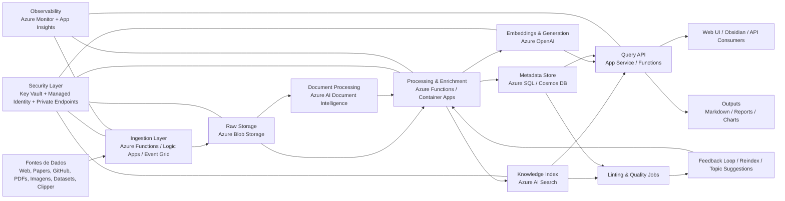

# 🧠 LLM-Powered Knowledge Platform on Azure

Arquitetura corporativa para uma plataforma de conhecimento baseada em LLM, com ingestão, enriquecimento, indexação semântica e consulta inteligente.

---

## 📌 Visão Geral

Plataforma composta por múltiplas camadas desacopladas, suportando:

- Ingestão de dados heterogêneos
- Processamento com IA (LLM + embeddings)
- Indexação vetorial e semântica
- Consulta via RAG
- Governança e melhoria contínua

---

## 🏗️ Arquitetura Lógica

# 🧠 Arquitetura Detalhada na Azure

## 📌 Visão Geral
Plataforma de conhecimento baseada em LLM com ingestão, processamento, indexação semântica e consulta inteligente.

---

## 📥 Fontes de Dados
A plataforma recebe dados de:

- Web articles  
- Research papers  
- Repositórios GitHub  
- Datasets estruturados  
- Imagens e PDFs  
- Notas manuais  
- Clipper / hotkeys  

**Armazenamento inicial:**
- Azure Blob Storage (zona `raw`)

**Processamento opcional:**
- Azure AI Document Intelligence (OCR e parsing)

---

## ⚙️ Camada de Ingestão

**Serviços:**
- Azure Functions (eventos leves)
- Azure Logic Apps (integrações)
- Azure Event Grid (event-driven)

**Objetivo:**
- Desacoplamento da entrada
- Escalabilidade por volume

---

## 🗄️ Armazenamento

### Estrutura sugerida:

| Diretório   | Função |
|------------|--------|
| raw        | dados originais |
| processed  | dados limpos |
| chunks     | fragmentos para indexação |
| artifacts  | outputs gerados |

**Outros componentes:**
- Azure SQL Database ou Cosmos DB → metadados
- Azure AI Search → índice semântico e vetorial

---

## 🧠 Processamento e Enriquecimento

### Etapas:
- Limpeza de texto
- OCR
- Normalização
- Chunking
- Extração de entidades
- Geração de embeddings
- Persistência de metadados

### Serviços:
- Azure Functions / Container Apps
- Azure OpenAI
- Azure AI Search

---

## 🔎 Base de Conhecimento

**Componentes:**
- Azure Blob Storage → dados base
- Azure AI Search → índice híbrido
- Azure SQL / Cosmos DB → catálogo
- Frontend (ex: Obsidian)

**Capacidades:**
- Busca semântica
- Busca vetorial (kNN)
- Ranking inteligente

---

## 💬 Consulta e Q&A

**Arquitetura:**
- Frontend → App Service / Static Web App
- Backend → App Service / Functions
- LLM → Azure OpenAI
- Retrieval → Azure AI Search

### Fluxo:
1. Usuário envia query  
2. Busca semântica (top-k)  
3. Construção de contexto  
4. Geração de resposta  

---

## 📤 Saídas

**Formatos:**
- Markdown (.md)
- HTML / PDF
- Slides
- Gráficos
- API REST

**Resposta inclui:**
- Conteúdo gerado
- Fontes
- Score de confiança
- Metadados
- Timestamp

---

## 🧹 Linting, Qualidade e Melhoria Contínua

**Funções:**
- Detectar duplicidade
- Identificar inconsistências
- Encontrar gaps
- Sugerir novos tópicos
- Validar conexões

**Execução:**
- Azure Functions
- Jobs agendados

---

## 🔐 Segurança

**Componentes:**
- Azure Key Vault
- Managed Identity
- Private Endpoints
- Microsoft Entra ID (RBAC)

---

## 📊 Observabilidade

**Ferramentas:**
- Azure Monitor
- Application Insights
- Log Analytics

**Métricas:**
- Latência de queries
- Tempo de indexação
- Taxa de erro
- Custo por consulta
- Qualidade de resposta

---

## 🔁 Evolução

**Ordem recomendada:**
1. Melhorar chunking  
2. Melhorar metadados  
3. Ajustar retrieval  
4. Aplicar reranking  
5. Avaliar fine-tuning  

---

## 🏢 Arquitetura Física

### Entrada
- Azure Front Door  
- App Service  
- API Management  

### Aplicação
- App Service  
- Azure Functions  
- Container Apps  
- Durable Functions  

### IA
- Azure OpenAI  
- Azure AI Search  
- Document Intelligence  

### Dados
- Azure Blob Storage  
- Azure SQL / Cosmos DB  

### Segurança
- Key Vault  
- Managed Identity  
- Private Endpoints  
- VNet Integration  
- Entra ID  

### Operação
- Azure Monitor  
- Application Insights  
- Log Analytics  
- Alerts  

---

## 🚀 MVP

- Azure Blob Storage  
- Azure AI Search  
- Azure OpenAI  
- App Service  
- Azure Functions  
- Key Vault  
- Application Insights  

---

## 🏢 Versão Enterprise

- Private Endpoints  
- API Management  
- Azure SQL / Cosmos DB  
- Document Intelligence  
- Front Door  
- Pipelines de linting  
- RBAC avançado  

---

## 🧭 Decisão de Arquitetura

**Stack recomendado:**
- Blob Storage → origem dos dados  
- Azure AI Search → núcleo semântico  
- Azure OpenAI → inteligência  
- Azure Functions → ingestão  
- App Service → API/UI  
- Key Vault + Managed Identity → segurança  

---

## 📎 Fonte
Conteúdo baseado no documento fornecido pelo usuário :contentReference[oaicite:0]{index=0}

Arquitetura detalhada na Azure
1. Fontes de dados

A plataforma recebe conteúdo de web articles, papers, repositórios GitHub, datasets, imagens, PDFs, notas manuais e capturas via “clipper” ou hotkey. Na Azure, esse material entra por conectores e APIs, com aterrissagem inicial no Azure Blob Storage como zona raw. Para cenários com parsing de documentos, OCR e extração de estrutura, o fluxo pode usar Azure AI Document Intelligence antes da indexação. O Azure AI Search suporta indexers para Blob Storage e outros repositórios, além de extração automática de conteúdo e chunking em cenários RAG.

2. Camada de ingestão

A ingestão pode ser feita por três trilhas:

Azure Functions para eventos leves e captura sob demanda.
Azure Logic Apps para integrações low-code.
Event Grid para reagir à chegada de novos arquivos no Blob Storage.
Esse desenho desacopla a entrada do processamento e facilita crescimento por volume. Para cargas maiores e pipelines orquestrados, o processamento pode seguir via Durable Functions ou outra camada de orquestração.
3. Armazenamento

Sugestão de organização no Azure Storage Account:

raw/ para conteúdo original
processed/ para texto extraído e normalizado
chunks/ para fragmentos prontos para indexação
artifacts/ para markdown, relatórios, imagens e apresentações geradas

Para consultas estruturadas e metadados de documentos, use um repositório relacional como Azure SQL Database ou Cosmos DB, enquanto o conteúdo vetorial e o índice semântico ficam no Azure AI Search. A separação entre blob, metadados e índice deixa o ambiente mais governável e mais simples de evoluir.

4. Processamento e enriquecimento

Depois da ingestão, o pipeline executa:

limpeza de texto
OCR quando necessário
normalização
chunking
extração de entidades e tópicos
geração de embeddings
persistência de metadados e índice

Para embeddings e raciocínio generativo, use Azure OpenAI. Para indexação vetorial e busca híbrida, use Azure AI Search, que suporta vector search, hybrid search, semantic ranking, analyzers multilíngues e integrated vectorization em cenários compatíveis.

5. Base de conhecimento

O equivalente profissional do “Wiki” do desenho fica assim:

Azure Blob Storage: fonte persistente dos documentos
Azure AI Search: índice textual + vetorial + semântico
Azure SQL / Cosmos DB: catálogo, tags, lineage, versionamento lógico
Obsidian ou frontend web: camada de consumo humano

Aqui o “wiki” deixa de ser apenas uma coleção de artigos e passa a ser uma knowledge platform com conteúdo indexado, enriquecido e pronto para consulta. O Azure AI Search é um serviço gerenciado de recuperação de informação e grounding para LLMs.

6. Consulta e Q&A

Para a etapa “Q&A / Querying”, eu montaria:

Frontend em Azure App Service ou Static Web App
Backend API em Azure App Service ou Azure Functions
Azure OpenAI para geração de resposta
Azure AI Search para recuperação semântica e vetorial
Application Insights para telemetria da experiência

Seu desenho original menciona “no RAG, LLM reads its own index”. Em ambiente corporativo na Azure, o mais seguro é usar RAG clássico ou agentic retrieval com Azure AI Search, para grounding, citações e controle de contexto. A própria documentação da Microsoft posiciona agentic retrieval como opção forte para chatbots e agentes, e classic RAG quando simplicidade e velocidade são prioridade.

7. Saídas

A etapa “Output Formats” pode ser materializada assim:

.md gerado em Blob Storage
relatórios HTML/PDF por Functions ou App Service
gráficos com Python em jobs dedicados
apresentações em templates externos
API REST para integração com portal, Teams ou outro frontend

A geração de resposta deve retornar também:

fontes consultadas
score de confiança
trechos relevantes
metadados do documento
timestamp da indexação

Esse formato melhora auditoria e reduz resposta opaca. A documentação de RAG da Microsoft enfatiza grounding e citações como parte do valor do desenho.

8. Linting, qualidade e melhoria contínua

A fase “Linting” do seu desenho pode virar um serviço próprio de qualidade:

detecção de duplicidade
inconsistência entre documentos
gaps temáticos
páginas órfãs
links quebrados
necessidade de reindexação
sugestão de novos tópicos

Essa camada pode rodar em Azure Functions, Container Apps ou jobs agendados, gravando resultados em SQL/Cosmos e emitindo alertas. Para ambientes com mais governança, vale incluir uma fila para backlog de correções.

9. Segurança

Para um ambiente corporativo na Azure, eu colocaria segurança como camada transversal:

Managed Identity entre App Service, Functions, Search e Storage
Azure Key Vault para segredos e chaves
Private Endpoints para Search, Storage e OpenAI
RBAC com Microsoft Entra ID
Shared Private Link quando o Azure AI Search precisar acessar recursos privados no downstream

A documentação do Azure AI Search recomenda uso de managed identity e documenta shared private link para acesso privado de saída a recursos como Storage e Key Vault.

10. Observabilidade e operação

Para operação:

Azure Monitor
Application Insights
Log Analytics
métricas de ingestão
métricas de indexação
latência de busca
custo por consulta
falhas por conector
drift de qualidade de resposta

Para produção, monitore especialmente:

atraso entre upload e indexação
taxa de chunking com erro
latência do Azure OpenAI
falhas de autenticação por identidade gerenciada
qualidade de recuperação por consulta

Esse bloco é importante para manter o sistema previsível conforme cresce. A arquitetura da Microsoft para apps RAG em App Service usa managed identity e observabilidade como parte do desenho operacional.

11. Evolução futura

A etapa “synthetic data + fine-tuning” pode existir, mas eu recomendaria esta ordem:

melhorar chunking
melhorar metadados
ajustar strategy de retrieval
aplicar reranking/semantic ranking
só depois avaliar fine-tuning

A própria orientação atual da Microsoft para RAG coloca foco em grounding, retrieval e indexação antes de qualquer personalização mais pesada do modelo.

Arquitetura física sugerida na Azure
Camada de entrada
Azure Front Door
App Service para portal
API Management se houver exposição externa de APIs
Camada de aplicação
App Service ou Azure Container Apps para backend
Azure Functions para jobs event-driven
Durable Functions para pipelines longos
Camada de IA
Azure OpenAI
Azure AI Search
Azure AI Document Intelligence
Camada de dados
Azure Blob Storage
Azure SQL Database ou Cosmos DB
Camada de segurança
Key Vault
Managed Identities
Private Endpoints
VNet Integration
Microsoft Entra ID
Camada operacional
Azure Monitor
Application Insights
Log Analytics
Alerts
Recomendação prática para o seu caso

Se a ideia é sair do desenho para algo implementável, eu montaria a primeira versão assim:

MVP corporativo

Blob Storage
Azure AI Search
Azure OpenAI
App Service
Functions
Key Vault
Application Insights

Versão enterprise

Private Endpoints
API Management
Azure SQL/Cosmos
Document Intelligence
Front Door
pipelines de linting e reindexação
RBAC por grupos do Entra ID
Decisão de arquitetura

Para este caso, eu seguiria este padrão:

Blob Storage como origem canônica
Azure AI Search como núcleo da base semântica
Azure OpenAI para embeddings e resposta
Functions para ingestão e manutenção
App Service para portal e API
Key Vault + Managed Identity + Private Endpoints para segurança.
